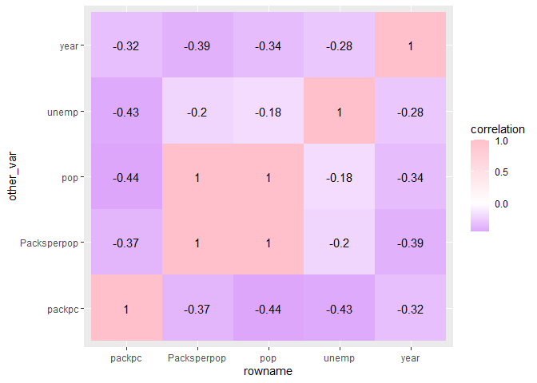
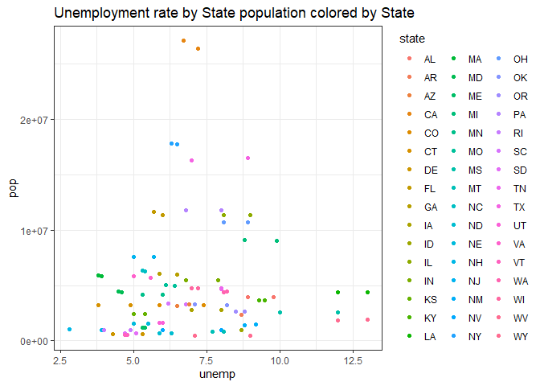
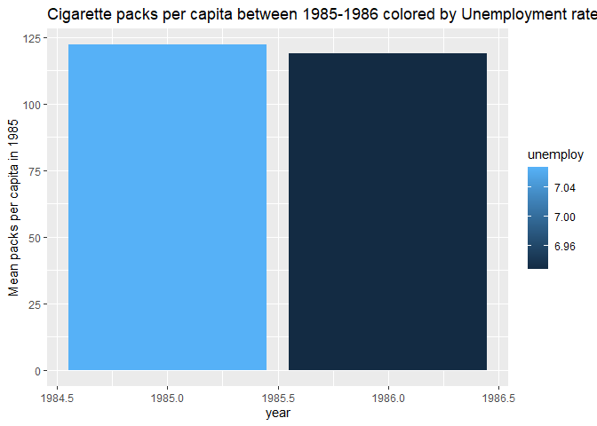
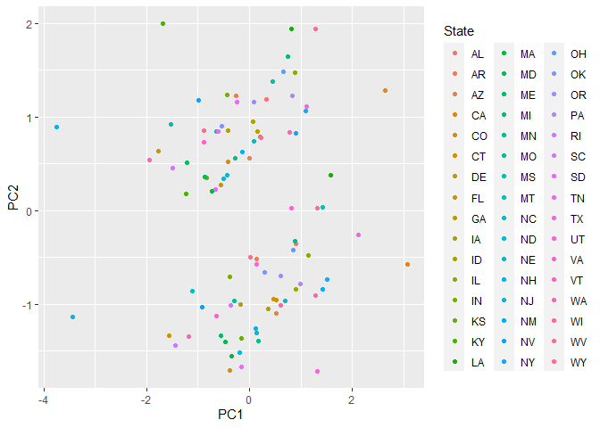
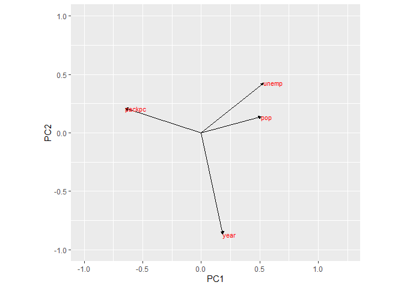
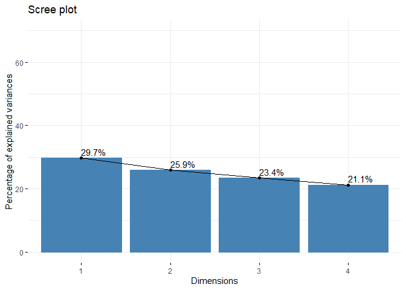

Project 1
================
Celeste Guerrero
3/16/2021

## Celeste Guerrero cbg928

This is an R Markdown document. Markdown is a simple formatting syntax
for authoring HTML, PDF, and MS Word documents. For more details on
using R Markdown see <http://rmarkdown.rstudio.com>.

When you click the **Knit** button a document will be generated that
includes both content as well as the output of any embedded R code
chunks within the document. You can embed an R code chunk like this:

``` r
# Installing necessary packages
library(readxl)
library(dplyr)
```

    ## 
    ## Attaching package: 'dplyr'

    ## The following objects are masked from 'package:stats':
    ## 
    ##     filter, lag

    ## The following objects are masked from 'package:base':
    ## 
    ##     intersect, setdiff, setequal, union

``` r
library(tidyverse)
```

    ## -- Attaching packages --------------------------------------- tidyverse 1.3.0 --

    ## v ggplot2 3.3.3     v purrr   0.3.4
    ## v tibble  3.0.5     v stringr 1.4.0
    ## v tidyr   1.1.2     v forcats 0.5.0
    ## v readr   1.4.0

    ## -- Conflicts ------------------------------------------ tidyverse_conflicts() --
    ## x dplyr::filter() masks stats::filter()
    ## x dplyr::lag()    masks stats::lag()

``` r
library(ggplot2)
library(cluster)

#Importing data set 1 
Cigarette <- read_excel("C:/Users/celes/Downloads/Cigarette.xlsx")
```

    ## New names:
    ## * `` -> ...1

``` r
glimpse(Cigarette)
```

    ## Rows: 528
    ## Columns: 10
    ## $ ...1   <dbl> 1, 2, 3, 4, 5, 6, 7, 8, 9, 10, 11, 12, 13, 14, 15, 16, 17, 1...
    ## $ state  <chr> "AL", "AR", "AZ", "CA", "CO", "CT", "DE", "FL", "GA", "IA", ...
    ## $ year   <dbl> 1985, 1985, 1985, 1985, 1985, 1985, 1985, 1985, 1985, 1985, ...
    ## $ cpi    <dbl> 1.076, 1.076, 1.076, 1.076, 1.076, 1.076, 1.076, 1.076, 1.07...
    ## $ pop    <dbl> 3973000, 2327000, 3184000, 26444000, 3209000, 3201000, 61800...
    ## $ packpc <dbl> 116.4863, 128.5346, 104.5226, 100.3630, 112.9635, 109.2784, ...
    ## $ income <dbl> 46014968, 26210736, 43956936, 447102816, 49466672, 60063368,...
    ## $ tax    <dbl> 32.50000, 37.00000, 31.00000, 26.00000, 31.00000, 42.00000, ...
    ## $ avgprs <dbl> 102.18167, 101.47500, 108.57875, 107.83734, 94.26666, 128.02...
    ## $ taxs   <dbl> 33.34834, 37.00000, 36.17042, 32.10400, 31.00000, 51.48333, ...

There are 528 observations across 10 variables focused on cigarette
consumption in the United States between 1985-1995.

``` r
# Import dataset 2 
Produc1 <- read_excel("C:/Users/celes/Downloads/Produc1.xlsx")
```

    ## New names:
    ## * `` -> ...1

``` r
glimpse(Produc1)
```

    ## Rows: 816
    ## Columns: 11
    ## $ ...1  <dbl> 1, 2, 3, 4, 5, 6, 7, 8, 9, 10, 11, 12, 13, 14, 15, 16, 17, 18...
    ## $ state <chr> "AL", "AL", "AL", "AL", "AL", "AL", "AL", "AL", "AL", "AL", "...
    ## $ year  <dbl> 1970, 1971, 1972, 1973, 1974, 1975, 1976, 1977, 1978, 1979, 1...
    ## $ pcap  <dbl> 15032.67, 15501.94, 15972.41, 16406.26, 16762.67, 17316.26, 1...
    ## $ hwy   <dbl> 7325.80, 7525.94, 7765.42, 7907.66, 8025.52, 8158.23, 8228.19...
    ## $ water <dbl> 1655.68, 1721.02, 1764.75, 1742.41, 1734.85, 1752.27, 1799.74...
    ## $ util  <dbl> 6051.20, 6254.98, 6442.23, 6756.19, 7002.29, 7405.76, 7704.93...
    ## $ pc    <dbl> 35793.80, 37299.91, 38670.30, 40084.01, 42057.31, 43971.71, 5...
    ## $ gsp   <dbl> 28418, 29375, 31303, 33430, 33749, 33604, 35764, 37463, 39964...
    ## $ emp   <dbl> 1010.5, 1021.9, 1072.3, 1135.5, 1169.8, 1155.4, 1207.0, 1269....
    ## $ unemp <dbl> 4.7, 5.2, 4.7, 3.9, 5.5, 7.7, 6.8, 7.4, 6.3, 7.1, 8.8, 11.0, ...

This data set represents the production data from the United States from
1970-1986. There are 816 observations across 11 variables.

``` r
#1 Tidying Data
# Wrangling data set 1 by filtering specific years
cigarette1 <- Cigarette %>%  filter(between(year,1985,1986))
cigarette1
```

    ## # A tibble: 96 x 10
    ##     ...1 state  year   cpi      pop packpc    income   tax avgprs  taxs
    ##    <dbl> <chr> <dbl> <dbl>    <dbl>  <dbl>     <dbl> <dbl>  <dbl> <dbl>
    ##  1     1 AL     1985  1.08  3973000   116.  46014968  32.5  102.   33.3
    ##  2     2 AR     1985  1.08  2327000   129.  26210736  37    101.   37  
    ##  3     3 AZ     1985  1.08  3184000   105.  43956936  31    109.   36.2
    ##  4     4 CA     1985  1.08 26444000   100. 447102816  26    108.   32.1
    ##  5     5 CO     1985  1.08  3209000   113.  49466672  31     94.3  31  
    ##  6     6 CT     1985  1.08  3201000   109.  60063368  42    128.   51.5
    ##  7     7 DE     1985  1.08   618000   144.   9927301  30    102.   30  
    ##  8     8 FL     1985  1.08 11352000   122. 166919248  37    115.   42.5
    ##  9     9 GA     1985  1.08  5963000   127.  78364336  28     97.0  28.8
    ## 10    10 IA     1985  1.08  2830000   114.  37902896  34    102.   37.9
    ## # ... with 86 more rows

``` r
# Wrangling data set 2 for certain variables
produc <- Produc1 %>% filter(between(year,1985,1986))
produc
```

    ## # A tibble: 96 x 11
    ##     ...1 state  year    pcap    hwy  water   util      pc    gsp    emp unemp
    ##    <dbl> <chr> <dbl>   <dbl>  <dbl>  <dbl>  <dbl>   <dbl>  <dbl>  <dbl> <dbl>
    ##  1    16 AL     1985  19433.  8726.  2253.  8454.  60688.  46849  1427.   8.9
    ##  2    17 AL     1986  19723.  8813.  2309.  8601.  61629.  48409  1463.   9.8
    ##  3    33 AZ     1985  19415.  6283.  2737. 10395.  39247.  43350  1279.   6.5
    ##  4    34 AZ     1986  20212.  6553.  2923. 10736.  44189.  46058  1338.   6.9
    ##  5    50 AR     1985   9675.  4639.   947.  4089.  33229.  27159   797.   8.7
    ##  6    51 AR     1986   9787.  4653.   961.  4174.  32889.  28168   814.   8.7
    ##  7    67 CA     1985 138171. 43566. 24121. 70483. 324335. 444082 10979    7.2
    ##  8    68 CA     1986 139043. 43351. 24592. 71100. 363780. 464550 11258    6.7
    ##  9    84 CO     1985  18327.  6058.  4153.  8117.  49793.  50820  1419.   5.9
    ## 10    85 CO     1986  18890.  6149.  4340.  8400.  47485.  51781  1408.   7.4
    ## # ... with 86 more rows

Both data sets were initially tidy, but some data wrangling was done
beforehand to make the combination of data sets easier in \#2. This
includes filtering the same years to allow this to be used as a
categorical variable if needed.

``` r
#2 Join and Merge Data sets
cig_produc <- produc %>% 
  left_join(cigarette1, by="state")
head(cig_produc)
```

    ## # A tibble: 6 x 20
    ##   ...1.x state year.x   pcap   hwy water   util     pc   gsp   emp unemp ...1.y
    ##    <dbl> <chr>  <dbl>  <dbl> <dbl> <dbl>  <dbl>  <dbl> <dbl> <dbl> <dbl>  <dbl>
    ## 1     16 AL      1985 19433. 8726. 2253.  8454. 60688. 46849 1427.   8.9      1
    ## 2     16 AL      1985 19433. 8726. 2253.  8454. 60688. 46849 1427.   8.9     49
    ## 3     17 AL      1986 19723. 8813. 2309.  8601. 61629. 48409 1463.   9.8      1
    ## 4     17 AL      1986 19723. 8813. 2309.  8601. 61629. 48409 1463.   9.8     49
    ## 5     33 AZ      1985 19415. 6283. 2737. 10395. 39247. 43350 1279.   6.5      3
    ## 6     33 AZ      1985 19415. 6283. 2737. 10395. 39247. 43350 1279.   6.5     51
    ## # ... with 8 more variables: year.y <dbl>, cpi <dbl>, pop <dbl>, packpc <dbl>,
    ## #   income <dbl>, tax <dbl>, avgprs <dbl>, taxs <dbl>

Data set 1 and 2 were combined using a left join by state as pictured
above. The join was appropriate because it allowed for further data
wrangling in the following steps.

``` r
#3 Summary Statistics 

#Selecting ideal variables from combined data set 
cleancigprod <- cig_produc %>% select(state,year.x,year.y,unemp,pop,packpc) %>% arrange(year.x)  #arranged  
head(cleancigprod)
```

    ## # A tibble: 6 x 6
    ##   state year.x year.y unemp     pop packpc
    ##   <chr>  <dbl>  <dbl> <dbl>   <dbl>  <dbl>
    ## 1 AL      1985   1985   8.9 3973000   116.
    ## 2 AL      1985   1986   8.9 3992000   117.
    ## 3 AZ      1985   1985   6.5 3184000   105.
    ## 4 AZ      1985   1986   6.5 3309000   103.
    ## 5 AR      1985   1985   8.7 2327000   129.
    ## 6 AR      1985   1986   8.7 2332000   128.

The variables selected include state which includes most states of the
U.S., year.x and year.y which correspond to produc and cigarette1,
respectively. Unemp is the state unemployment rate, pop is the state
population and packpc is the number of cigarette packs per capita.

``` r
# Observations based on same year across states
yearsim <- cleancigprod %>% mutate(Year = if_else(year.x == year.y, "Equal", "Not Equal")) %>% filter(Year == "Equal") #Creating a variable to filter out the true cases where the years match up 
yearsim
```

    ## # A tibble: 96 x 7
    ##    state year.x year.y unemp      pop packpc Year 
    ##    <chr>  <dbl>  <dbl> <dbl>    <dbl>  <dbl> <chr>
    ##  1 AL      1985   1985   8.9  3973000   116. Equal
    ##  2 AZ      1985   1985   6.5  3184000   105. Equal
    ##  3 AR      1985   1985   8.7  2327000   129. Equal
    ##  4 CA      1985   1985   7.2 26444000   100. Equal
    ##  5 CO      1985   1985   5.9  3209000   113. Equal
    ##  6 CT      1985   1985   4.9  3201000   109. Equal
    ##  7 DE      1985   1985   5.3   618000   144. Equal
    ##  8 FL      1985   1985   6   11352000   122. Equal
    ##  9 GA      1985   1985   6.5  5963000   127. Equal
    ## 10 ID      1985   1985   8     994000   103. Equal
    ## # ... with 86 more rows

``` r
#Clean data, removing extra variables, renamed
clean <- yearsim %>% select(-Year, -year.y) %>% rename("year"=year.x)
glimpse(clean) #final dataset 
```

    ## Rows: 96
    ## Columns: 5
    ## $ state  <chr> "AL", "AZ", "AR", "CA", "CO", "CT", "DE", "FL", "GA", "ID", ...
    ## $ year   <dbl> 1985, 1985, 1985, 1985, 1985, 1985, 1985, 1985, 1985, 1985, ...
    ## $ unemp  <dbl> 8.9, 6.5, 8.7, 7.2, 5.9, 4.9, 5.3, 6.0, 6.5, 8.0, 9.0, 7.9, ...
    ## $ pop    <dbl> 3973000, 3184000, 2327000, 26444000, 3209000, 3201000, 61800...
    ## $ packpc <dbl> 116.4863, 104.5226, 128.5346, 100.3630, 112.9635, 109.2784, ...

``` r
# New variable representing packs of cigarettes consumed for each state population 
clean1 <- clean %>% mutate(Packsperpop = packpc*pop)
clean1
```

    ## # A tibble: 96 x 6
    ##    state  year unemp      pop packpc Packsperpop
    ##    <chr> <dbl> <dbl>    <dbl>  <dbl>       <dbl>
    ##  1 AL     1985   8.9  3973000   116.  462800000.
    ##  2 AZ     1985   6.5  3184000   105.  332800001.
    ##  3 AR     1985   8.7  2327000   129.  299099995.
    ##  4 CA     1985   7.2 26444000   100. 2654000153.
    ##  5 CO     1985   5.9  3209000   113.  362499997.
    ##  6 CT     1985   4.9  3201000   109.  349800001.
    ##  7 DE     1985   5.3   618000   144.   88900002.
    ##  8 FL     1985   6   11352000   122. 1387000095.
    ##  9 GA     1985   6.5  5963000   127.  758700034.
    ## 10 ID     1985   8     994000   103.  102400004.
    ## # ... with 86 more rows

``` r
#Summary statistics overall 
clean1 %>% summarize(mean(unemp), mean(pop), mean(packpc), mean(Packsperpop))
```

    ## # A tibble: 1 x 4
    ##   `mean(unemp)` `mean(pop)` `mean(packpc)` `mean(Packsperpop)`
    ##           <dbl>       <dbl>          <dbl>               <dbl>
    ## 1          7.00    4934031.           120.          584267715.

These summary statistics represent the overall mean of each variable
regardless of state or year in the United States. Therefore, the average
unemployment rate across the states between 1985-1986 was 6.99, the mean
population was 4934031 people, the mean packs of cigarette consumption
per capita was 120, and the mean packs of cigarettes across the
population was 584267715.

``` r
# Summary statistics based on state between 1985-1986
clean1 %>% group_by(state) %>%summarize(mean(pop), mean(unemp), mean(packpc), mean(Packsperpop)) 
```

    ## # A tibble: 48 x 5
    ##    state `mean(pop)` `mean(unemp)` `mean(packpc)` `mean(Packsperpop)`
    ##  * <chr>       <dbl>         <dbl>          <dbl>               <dbl>
    ##  1 AL        3982500          9.35          117.           465249997.
    ##  2 AR        2329500          8.7           128.           298399996.
    ##  3 AZ        3246500          6.7           104.           337299997.
    ##  4 CA       26775000          6.95           98.4         2633050093.
    ##  5 CO        3223500          6.65          111.           358099995.
    ##  6 CT        3212500          4.35          108.           347000002.
    ##  7 DE         623000          4.8           142.            88650000.
    ##  8 FL       11510500          5.85          121.          1397250064.
    ##  9 GA        6024000          6.2           127.           764450012.
    ## 10 IA        2811000          7.5           111.           311400003.
    ## # ... with 38 more rows

The summary statistics represent the mean of the numeric variables as
shown above, but grouped by state. Therefore, they represent the mean of
the variable between 1985 and 1986 per each state.

``` r
#Summary Statistics cont 
clean1 %>% group_by(year) %>% summarize(mean(pop), mean(unemp), mean(packpc), mean(Packsperpop)) 
```

    ## # A tibble: 2 x 5
    ##    year `mean(pop)` `mean(unemp)` `mean(packpc)` `mean(Packsperpop)`
    ## * <dbl>       <dbl>         <dbl>          <dbl>               <dbl>
    ## 1  1985    4911271.          7.07           122.          588497924.
    ## 2  1986    4956792.          6.93           119.          580037505.

These summary statistics describe the means of state population,
unemployment rate, packs of cigarettes per capita, and packs of
cigarettes per population grouped by the years 1985-1986. They give an
idea of the changes that occurred in the U.S. over the years despite
state specificity.

``` r
 # Correlation Matrix, filtered out non numeric variables
cigproduc1 <- as.data.frame(clean1) %>% select(-state)
head(cigproduc1)
```

    ##   year unemp      pop   packpc Packsperpop
    ## 1 1985   8.9  3973000 116.4863   4.628e+08
    ## 2 1985   6.5  3184000 104.5226   3.328e+08
    ## 3 1985   8.7  2327000 128.5346   2.991e+08
    ## 4 1985   7.2 26444000 100.3630   2.654e+09
    ## 5 1985   5.9  3209000 112.9635   3.625e+08
    ## 6 1985   4.9  3201000 109.2784   3.498e+08

``` r
# Correlation matrix
library(corrplot)
```

    ## Warning: package 'corrplot' was built under R version 4.0.4

    ## corrplot 0.84 loaded

``` r
cor1 <- cigproduc1 %>% select_if(is.numeric) %>%
cor(cigproduc1, use = "pairwise.complete.obs")
cor1
```

    ##                     year       unemp          pop      packpc  Packsperpop
    ## year         1.000000000 -0.03317431  0.004466174 -0.07723410 -0.007525058
    ## unemp       -0.033174308  1.00000000  0.065536843 -0.11096026  0.075440386
    ## pop          0.004466174  0.06553684  1.000000000 -0.09259659  0.987076546
    ## packpc      -0.077234103 -0.11096026 -0.092596594  1.00000000  0.011687936
    ## Packsperpop -0.007525058  0.07544039  0.987076546  0.01168794  1.000000000

``` r
#Correlation heat map
cor(cor1, use = "pairwise.complete.obs") %>%
  # Save as a data frame
  as.data.frame %>%
  # Convert row names to an explicit variable
  rownames_to_column %>%
  # Pivot so that all correlations appear in the same column
  pivot_longer(-1, names_to = "other_var", values_to = "correlation") %>%
  ggplot(aes(rowname, other_var, fill=correlation)) +
  # Heatmap with geom_tile
  geom_tile() +
  # Change the scale to make the middle appear neutral
  scale_fill_gradient2(low="purple",mid="white",high="pink") +
  # Overlay values
  geom_text(aes(label = round(correlation,2)), color = "black", size = 4)
```

<!-- -->
Based on the heat map, there is little to no correlation between the
numeric variables in the data frame. The closest correlation is between
state unemployment rate and state population with a factor of -0.18 and
this will be looked into further.

``` r
# Visualizations 
# Plot of unemployment rate and state population colored by state
ggplot(data=clean, mapping = aes(x = unemp, y = pop)) + 
  geom_point(aes(color = state)) +
  theme_bw() + ggtitle("Unemployment rate by State population colored by State") 
```

<!-- -->
The visualization above represents the state unemployment rate by the
state population colored by the different states. It appears there is no
correlation as shown by the matrix, but it shows some interesting
findings. States with the highest unemployment rates have low state
population while states with high population have the average overall
unemployment rate.

``` r
# Visualization
clean2 <- clean %>% 
  group_by(year) %>% 
  select(state, packpc, unemp, year) %>%
  summarise(packs = mean(packpc), unemploy = mean(unemp))
clean2
```

    ## # A tibble: 2 x 3
    ##    year packs unemploy
    ## * <dbl> <dbl>    <dbl>
    ## 1  1985  122.     7.07
    ## 2  1986  119.     6.93

``` r
ggplot(clean2, aes(x = year, y = packs)) + geom_bar(stat = "summary", fun = mean, aes(fill = unemploy)) + scale_y_continuous(breaks =seq(0,150,25), name= "Mean packs per capita in 1985") + geom_errorbar(stat = "summary", width = 0.5) + ggtitle("Cigarette packs per capita between 1985-1986 colored by Unemployment rate") 
```

    ## No summary function supplied, defaulting to `mean_se()`

<!-- -->
Based on the above visualization, there was a decrease in the mean
cigarette pack consumption per capita from 1985-1986 across the United
States. There was also a decrease in the unemployment rate across the
U.S. regardless of specific state trends.

``` r
# Perform k-means/PAM cluster/PCA 
pca <- clean %>%
  # Remove categorical variables
  select(-state) %>%   
  # Scale to 0 mean and unit variance (standardize)
  scale() %>%           
  prcomp()
names(pca)
```

    ## [1] "sdev"     "rotation" "center"   "scale"    "x"

``` r
pca #visualize pca results
```

    ## Standard deviations (1, .., p=4):
    ## [1] 1.0893182 1.0169429 0.9670865 0.9186711
    ## 
    ## Rotation (n x k) = (4 x 4):
    ##               PC1        PC2         PC3        PC4
    ## year    0.1857235 -0.8692674 -0.07338439 -0.4522120
    ## unemp   0.5321400  0.4264017 -0.51725197 -0.5171644
    ## pop     0.5126958  0.1368137  0.82680445 -0.1865996
    ## packpc -0.6476703  0.2093748  0.20846947 -0.7023004

``` r
head(pca$x) #View rotated data
```

    ##               PC1       PC2          PC3        PC4
    ## [1,]  0.325903225 1.1892717 -0.593308102  0.1438493
    ## [2,]  0.001908984 0.5580009 -0.243207990  1.1674353
    ## [3,] -0.260529951 1.2241881 -0.690010436 -0.1484244
    ## [4,]  2.636495110 1.2810980  3.295803791  0.2851758
    ## [5,] -0.408500687 0.5197990 -0.006624566  1.0339214
    ## [6,] -0.551377178 0.2782596  0.203885567  1.4053811

``` r
pca_data <- data.frame(pca$x, State = clean$state) #Groups by State added in
head(pca_data)
```

    ##            PC1       PC2          PC3        PC4 State
    ## 1  0.325903225 1.1892717 -0.593308102  0.1438493    AL
    ## 2  0.001908984 0.5580009 -0.243207990  1.1674353    AZ
    ## 3 -0.260529951 1.2241881 -0.690010436 -0.1484244    AR
    ## 4  2.636495110 1.2810980  3.295803791  0.2851758    CA
    ## 5 -0.408500687 0.5197990 -0.006624566  1.0339214    CO
    ## 6 -0.551377178 0.2782596  0.203885567  1.4053811    CT

``` r
# Visualization of PCA 
ggplot(pca_data, aes(x = PC1, y = PC2, color = State)) + 
  geom_point() 
```

<!-- -->
There appears to be two clusters of states that are most similar based
on the PCA plot above.

``` r
pca$rotation
```

    ##               PC1        PC2         PC3        PC4
    ## year    0.1857235 -0.8692674 -0.07338439 -0.4522120
    ## unemp   0.5321400  0.4264017 -0.51725197 -0.5171644
    ## pop     0.5126958  0.1368137  0.82680445 -0.1865996
    ## packpc -0.6476703  0.2093748  0.20846947 -0.7023004

``` r
rotation_data <- data.frame(
  pca$rotation, 
  variable = row.names(pca$rotation))
arrow_style <- arrow(length = unit(0.05, "inches"), type = "closed")

 # Visual of the contribution of variables to PC
ggplot(rotation_data) + 
  geom_segment(aes(xend = PC1, yend = PC2), x = 0, y = 0, arrow = arrow_style) + 
  geom_text(aes(x = PC1, y = PC2, label = variable), hjust = 0, size = 3, color = "red") + 
  xlim(-1., 1.25) + 
  ylim(-1., 1.) +
  coord_fixed() 
```

<!-- -->
The variables year, unemp and pop influence PC1 more strongly. The
variable packpc influences PC2 more strongly based on the above figure.
Again, based on the loading plot there is a small angle between
unemployment rate and state population which signifies a more positive
correlation as opposed to the others.

``` r
#Scree plot 
library(tidyverse)
library(cluster)
library(factoextra)
```

    ## Warning: package 'factoextra' was built under R version 4.0.4

    ## Welcome! Want to learn more? See two factoextra-related books at https://goo.gl/ve3WBa

``` r
fviz_eig(pca, addlabels = TRUE, ylim = c(0, 70))
```

<!-- -->
Based on the scree plot, PCA is not the best fit for the data as there
is no steep curve with a plateau seen.
